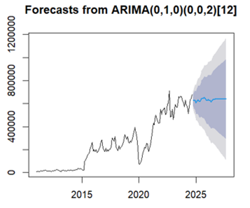

# NHS Emergency Department Waiting Time Analytics

A healthcare analytics project investigating the factors contributing to NHS Accident & Emergency (A&E) waiting times in England using statistical analysis, regression modeling, and SARIMA forecasting techniques.

This project applies data-driven methodologies to evaluate operational bottlenecks, workforce pressures, and healthcare system performance between 2016 and 2023.

---

# Overview

Emergency department waiting times have become one of the largest operational challenges facing the NHS. This project investigates the key factors contributing to delays in A&E departments across England and explores how predictive analytics can support healthcare decision-making.

Using NHS operational datasets, workforce statistics, demographic information, and hospital capacity metrics, the project combines descriptive, predictive, and prescriptive analytics to identify relationships between healthcare system pressures and patient waiting times.

The analysis focuses on:
- workforce shortages
- bed occupancy rates
- demographic pressures
- seasonal demand fluctuations
- operational inefficiencies
- forecasting future A&E performance trends

---

# Objectives

The objectives of this project were to:

- identify the main drivers of A&E waiting time delays
- evaluate relationships between operational healthcare variables
- assess NHS performance trends between 2016–2023
- forecast future emergency department waiting times using SARIMA modeling
- provide data-driven recommendations to improve patient flow and operational efficiency

---

# Data Sources

The datasets used in this project were collected from publicly available NHS and UK government sources.

Primary datasets included:
- NHS England A&E performance statistics
- Bed occupancy rates
- Workforce and staffing data
- Population demographics
- Hospital admission statistics
- Emergency care operational metrics

Project dataset characteristics:
- 88 variables
- 704 observations
- Time period: 2016–2023

---

# Methodology

The project used a combination of descriptive, predictive, and prescriptive analytics techniques.

## Data Preprocessing

Data preprocessing included:
- handling missing values
- cleaning inconsistent records
- variable transformation
- normalization and scaling
- correlation assessment
- feature selection

Python/R workflows were used to prepare datasets before statistical analysis.

---

# Analytical Techniques

The following analytical methods were applied:

## Correlation Analysis
Used to identify relationships between operational variables and waiting time performance.

## Multiple Regression Analysis
Used to evaluate how factors such as staffing levels, bed occupancy, and patient demand impacted A&E delays.

## Non-Linear Regression
Applied to assess more complex relationships between healthcare system variables.

## SARIMA Forecasting
Used to forecast future waiting time trends and assess future NHS operational pressures through 2027.

---

# Key Findings

The analysis identified several major contributors to NHS emergency department delays:

- high bed occupancy rates significantly increased waiting times
- staffing shortages negatively impacted operational efficiency
- seasonal demand pressures worsened delays
- demographic growth increased system strain
- operational bottlenecks reduced patient flow efficiency

Forecasting analysis suggested that without operational intervention, waiting times are likely to continue increasing over future periods.

---

# Recommendations

Based on the analysis, the following recommendations were proposed:

- increase staffing capacity during peak demand periods
- improve patient discharge efficiency to reduce bed occupancy pressure
- expand operational resource allocation in high-demand regions
- implement predictive monitoring systems for demand forecasting
- strengthen long-term workforce planning strategies

---

# Repository Structure

```text
reports/        → Dissertation report and executive summary
figures/        → Forecasting charts, regression outputs, and visualizations
code/           → Statistical analysis and forecasting scripts
data/           → NHS datasets and cleaned analytical data
references/     → Research sources and supporting literature
```

---

# Analytical Workflow

The analytical workflow followed these stages:

1. Data collection from NHS and government databases
2. Data cleaning and preprocessing
3. Exploratory data analysis
4. Correlation analysis
5. Regression modeling
6. SARIMA forecasting
7. Interpretation of findings
8. Strategic recommendations

---

# Technologies Used

- Python / R
- Pandas
- NumPy
- ggplot2
- Forecast package
- Matplotlib
- Excel
- Jupyter Notebook
- Statistical Modeling
- Time Series Forecasting

---

# Limitations

Several limitations affected the project:

- incomplete NHS reporting in certain periods
- operational variables difficult to quantify consistently
- forecasting uncertainty due to changing healthcare conditions
- external policy and funding changes affecting NHS performance

Despite these limitations, the project provided meaningful operational and strategic insights into NHS emergency department performance.

---

# Future Improvements

Potential future improvements include:

- machine learning forecasting models
- interactive healthcare dashboards
- regional-level predictive analytics
- real-time operational monitoring systems
- patient flow simulation modeling

---
## SARIMA Forecasting of NHS A&E Waiting Times



# Author

Razan Aziz
